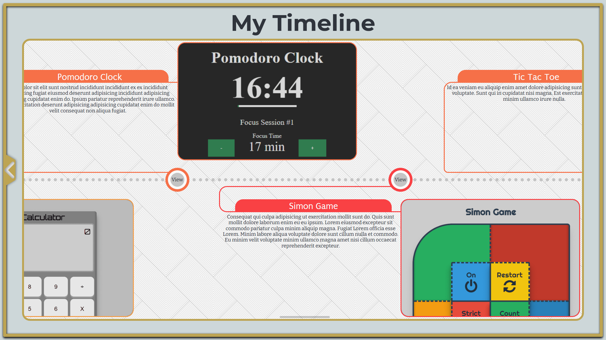
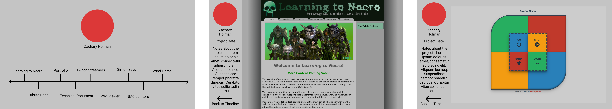
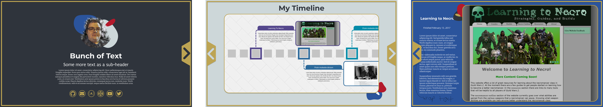

# Timeline Portfolio

### [Timeline Portfolio](https://zachary-holman.netlify.app//) (Click to view functional site)

_Completed September 18, 2022_

It was time to update my portfolio. I was happy with my previous portfolio, but it was one of the first few projects in the freeCodeCamp curriculum. I felt I could do better with all that I have learned since then. I decided to throw everything together for for this project: React, Redux, TypeScript, and Gatsby.

I wanted to make something better than my [previous portfolio](/project/personal-portfolio), something that used more of what I have learned while continuing to go through the challenges and lessons on freeCodeCamp.

I wanted to make a site using _React_ and _Redux_. After doing some digging I decided that learning [Gatsby](https://www.gatsbyjs.com/) was something I wanted to learn as well. It could provide a starting point for any _React_ project I decide to do from here on out. While my own [React boilerplate](/project/react-redux-boilerplate) is something I could update and continue to use. I feel like keeping up with the frequent changes _React_, _Webpack_, and all the other packages I use would be somewhat bothersome. I'm glad to have gone through the experience of learning the process of building my own boilerplate, but I'm ready to use what is readily available.

_Gatsby_ has many features and plugins to expand what on what it is capable of doing. For this project I tried to keep it fairly basic. I'm including some _Gatsby_ plugins that render markdown into generated HTML pages. That's how I have created all of these project pages on this timeline. _Gatsby_ uses _GraphiQL_ in the background for many things and learning it has been a bit of a challenge for me. Linking images took a while to figure out, as there you have to query _GraphiQL_ for the images to be able to use them. This is so _Gatsby_ can optimize and lazy-load images appropriately to hopefully provide a smoother and faster experience for the user.

I continued what I have learned from doing my previous client based projects and started with some style tiles, I then moved on to make some mockups.

First draft mockup:

Secondary mockup:

I created many more mockups and visual aids other than these, but these would be the main ones.

Overall I am very happy with how this project turned out. I accomplished my goal in making a better portfolio and used everything I have learned so far to make this website.
