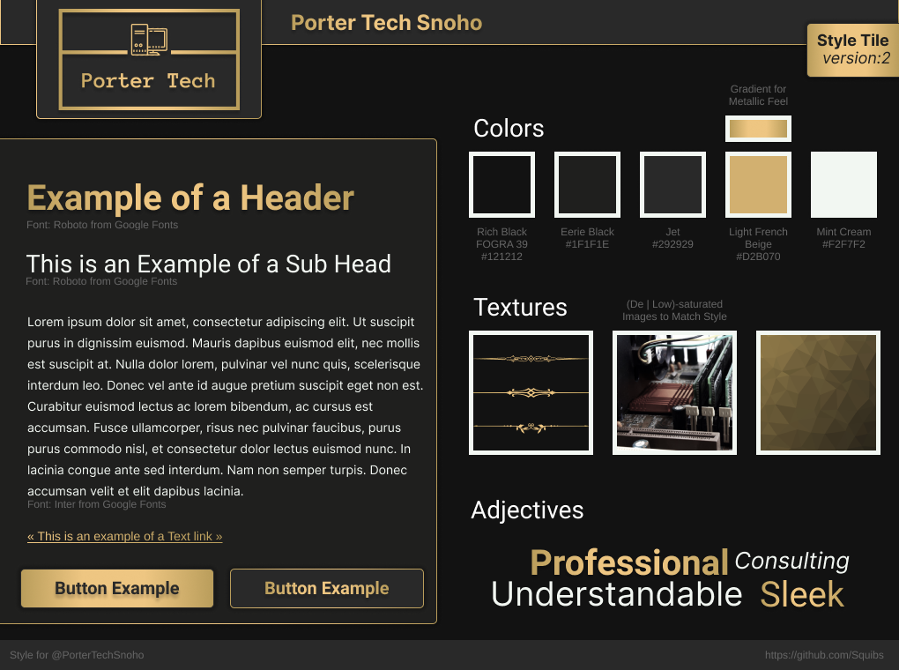

### Project Information

Another website I created for a client. The purpose of this project is to create a website from scratch for his semi-established repair, tech education, and general IT business. The main requested features are to created a modern/professional feeling website, following a black and gold color scheme (later changed to emerald and gold), and to potentially gain more local customers through web traffic.

I spent a good amount of time refining my mockup and pre-planning for website creation with this project. I learned about creating [Style Tiles](https://styletil.es/), which I wanted to try out for the mock-up process. This includes making some visual guide lines for how the site may look, which after I created then made a further mockup which I could then follow for when creating the site.

Style Tiles:

Mockup:

I again used [Netlify](https://www.netlify.com/) to host this website, and used much of what I learned from my previous two client projects, [Wind Home Appliance Repair](/projects/wind-home) and [NMC Janitorial Services](/projects/nmc-janitorial), to assist in the creation.
